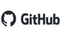

# Python Course Repository

Welcome to the Python Course repository! This free repository is designed to provide a comprehensive Python programming course for beginners. 
Whether you're new to programming or have some experience, this course will help you learn and improve your Python skills.

**Happy coding and enjoy the Python course!**


## Table of Contents
- [Contributing](#contributing)
- [About Python](#about-python)
- [Getting Started](#getting-started)
- [Course Overview](#course-overview)
- [Course Structure](#course-structure)


## Contributing

We welcome contributions to this free Python course. If you find any issues, have suggestions for improvements, 
or want to add new content, please feel free to open an issue. Your contributions will help make this course even better for future learners.

Support me to create more educational materials!

<p align="center">
    <a href="https://paypal.me/sergifelipribas"></a>
    <a href="https://github.com/sergif-github"></a>
    <a href="https://www.linkedin.com/in/sergifelipribas/"></a>
</p>


## About Python

Python is a versatile and widely used programming language that bears a close resemblance to human language. Its similarity to natural language makes it easy to learn and use, appealing to beginners and experienced developers alike. Python finds applications in various industries and is employed for web development, desktop software, system administration, and the creation of machine learning libraries. It has gained significant popularity in the data science and machine learning community.

Python is a high-level, interpreted programming language with cross-platform capabilities. Guido van Rossum developed it in 1989, and since then, it has become a staple for diverse software development tasks. Python enables the creation of web applications, desktop software, data analysis tools, artificial intelligence implementations, and automation scripts. Its appeal lies in its simple and readable syntax, extensive library ecosystem, and the wealth of available resources for learning.

As an interpreted language, Python requires an interpreter to read, interpret, and execute the source code. In contrast to compiled languages like C or C++, which transform code into machine language using a compiler, Python's interpreter provides flexibility. However, interpreted languages generally tend to be slower and less secure than their compiled counterparts. Python comes with its own default interpreter known as the "Python interpreter."

Python code can be executed from the command line, and many integrated development environments (IDEs) utilize the default Python interpreter. Additionally, alternative interpreters like IPython and Jupyter offer enhanced interactivity and environments resembling a command-line shell or a notebook interface. Popular IDEs for Python development include PyCharm, Spyder, Eclipse with the PyDev plugin, Visual Studio Code, and Jupyter Notebook. Notable libraries in the Python ecosystem include NumPy, Pandas, Matplotlib, Scikit-learn, TensorFlow, Keras, and PyTorch.

## Getting Started

In this course, you have the flexibility to choose between using JupyterLab or an IDE with a Python installation, or opting for the convenience
of Google Colab without any local installations. Both options provide powerful environments for writing, executing, and collaborating on code.

If you already have Python installed and prefer to work locally, JupyterLab or an IDE will offer a seamless coding experience. On the other hand,
if you prefer a cloud-based environment, Google Colab will provide you with the necessary tools and resources.

Feel free to choose the option that best suits your preferences and needs. Throughout the course, we will provide instructions and examples
that are compatible with both setups.

Now that you have the necessary information to get started, let's embark on this exciting learning journey together!


### Python Installation (for JupyterLab and IDEs)

If you prefer using an IDE or JupyterLab on your local machine, it's essential to have Python installed. 
Python serves as the foundation for running JupyterLab and executing Python code. 

Follow these steps to install Python:

1. Check if Python is already installed by running ```python --version``` command.
    If Python is already installed, you will see the installed version. If not, continue to the next step.

2. Install Python
    To install Python, visit the official Python website at [python.org](https://www.python.org/). Choose the appropriate installer 
for your operating system (Windows, macOS, or Linux) and follow the installation instructions.

    During the installation, make sure to select the option to add Python to your system's PATH variable. This will make it easier to access Python
from the command prompt or terminal.


### Choose between Integrated Development Environments (IDEs)

Integrated Development Environments (IDEs) provide a comprehensive environment for writing, editing, and running Python code.
IDEs offer features such as code completion, debugging tools, and project management capabilities, making them popular among 
developers for efficient and productive coding.

- **Visual Studio Code (VS Code)**

    Visual Studio Code, commonly referred to as VS Code, is a popular open-source code editor developed by Microsoft. 
It offers a wide range of extensions and a big community, making it a powerful choice for Python development.

    Install VS Code from the official website (https://code.visualstudio.com/).


- **PyCharm**

    PyCharm is a professional Python IDE developed by JetBrains. It offers a rich set of features specifically designed for Python development,
including intelligent code completion, debugging tools, and support for various frameworks.

  Download and install PyCharm Community Edition (free) or PyCharm Professional Edition (commercial) from the JetBrains website (https://www.jetbrains.com/pycharm/).


- **Atom**

    Atom is a customizable text editor developed by GitHub. It offers a vast ecosystem of packages and themes, 
making it a popular choice for Python developers who prefer flexibility and extensibility.

    Install Atom from the official website (https://atom.io/).

These are just a few examples of the many IDEs available for Python development. Each IDE has its own set of features and workflows,
so feel free to explore and choose the one that best fits your needs and preferences.

By using an IDE, you can streamline your Python development process, benefit from advanced code editing capabilities, 
and boost your productivity as a Python programmer. You will need to install extensions to work with .ipynb files used in this course.
On the other hand, you can use JupyterLab or Google Cloab.

- **JupyterLab**

    JupyterLab is a powerful interactive development environment that allows you to create and run Jupyter notebooks, code, and markdown files. 

    Install JupyterLab with ```pip install jupyterlab``` command. Wait for the installation to complete. 
Once done, JupyterLab should be installed on your system.

    Launch JupyterLab by running the following command: ```jupyter lab```. This will open JupyterLab in your default web browser.

### Google Colab (No Installations Required)

Alternatively, if you prefer a hassle-free setup without any installations on your local machine, you can utilize Google Colab. 
Google Colab provides a cloud-based environment where you can create, run, and collaborate on Jupyter notebooks without the need for local installations.
Google Colab provides pre-installed libraries, including Python and popular data science packages like NumPy and Pandas. You can directly write
and execute code in the notebook cells.

To access Google Colab:

1. Open Google Colab: Visit the Google Colab website using any web browser.
2. Create a New Notebook: Click on "New Notebook" to create a new blank notebook or choose from existing templates.


### Files used

In this course, we have chosen .ipynb files as the primary format to provide an interactive and comprehensive learning experience. 
The course material, including code examples, exercises, and project templates, will be provided as Jupyter Notebooks (.ipynb files).

You can open and run the .ipynb files using JupyterLab, Jupyter Notebook, or other compatible environments. These tools offer an interactive
interface where you can execute code cells, modify the code, add your own notes, and visualize the results.

By using .ipynb files, we aim to provide an engaging and hands-on learning experience that combines code, documentation, and visualization,
allowing you to grasp concepts more effectively and apply them in practical scenarios.


## Course Overview

This Python course is designed to introduce you to the fundamentals of programming using the Python programming language. 
The course covers a wide range of topics, starting from the basics and gradually progressing to more advanced concepts.

Here are some of the key topics covered in this course:
- Introduction to Python
- Basic variables and data types
- Basic operators
- Control flow statements
- Loops
- Methods and functions
- Object-oriented programming (OOP)
- Exception handling
- Modules and packages
- File handling
- Additional Python modules and libraries
- Advanced concepts
- Testing and debugging

The course is structured in a way that each topic builds upon the previous ones, providing a logical progression of learning. 
Each topic includes theory explanations, practical examples, and exercises to reinforce your understanding.

The goal of this course is to cover foundational aspects of Python programming with an emphasis on script writing,
basic data manipulation, and program organization.  By the end of this course, students should be able to start writing 
useful Python programs on their own or be able to understand and modify Python code written by their coworkers.


## Course Structure

The course is organized into different modules, each covering a specific topic. 

You can start with the first module and progress through the course at your own pace. Make sure to read the lecture notes, 
try out the examples, and complete the exercises to solidify your knowledge.

Inside the repository, you'll find the following structure:

**[Module 0: Introduction to Python](./00-Introduction_to_Python/)**
- [Introduction to Python](./00-Introduction_to_Python/01_introduction_python.ipynb)
- [Running Python programs](./00-Introduction_to_Python/02_running_python_programs.ipynb)
- [Basic syntax and indentation](./00-Introduction_to_Python/03_basic_syntax_and_identation.ipynb)
- [Printing and commenting code](./00-Introduction_to_Python/04_printing_and_commenting_code.ipynb)
- [User input](./00-Introduction_to_Python/05_user_input.ipynb)
- [Exercises](./00-Introduction_to_Python/06_exercisies.ipynb)
- [Solutions](./00-Introduction_to_Python/07_solutions.ipynb)

**[Module 1: Variables and Data Types](./01-Variables_and_data_types/)**
- [Variables and assignments](./01-Variables_and_data_types/01_variables_and_assignments.ipynb)
- [Numeric data types (int, float)](./01-Variables_and_data_types/02_numeric_data_types.ipynb)
- [Strings and string manipulation](./01-Variables_and_data_types/03_string_and_manipulation.ipynb)
- [Boolean data type](./01-Variables_and_data_types/04_boolean_data_types.ipynb)
- [Type conversion and casting](./01-Variables_and_data_types/05_type_conversion_and_casting.ipynb)
- [Working with collections (lists, tuples, sets, dictionaries)](./01-Variables_and_data_types/06_collections.ipynb)
- [Exercises](./01-Variables_and_data_types/07_exercisies.ipynb)
- [Solutions](./01-Variables_and_data_types/08_solutions.ipynb)

**[Module 2: Operators](./02-Operators)**
- [Arithmetic operators](02-Operators/01_arithmetic_operators.ipynb)
- [Comparison operators](02-Operators/02_comparison_operators.ipynb)
- [Logical operators](02-Operators/03_logical_operators.ipynb)
- [Assignment operators](02-Operators/04_assignment_operators.ipynb)
- [Bitwise operators](02-Operators/05_bitwise%20operators.ipynb)
- [Operator precedence](02-Operators/06_operator_precedence.ipynb)
- [Exercises](./02-Operators/07_exercises.ipynb)
- [Solutions](./02-Operators/08_solutions.ipynb)

**[Module 3: Control Flow Statements](./03-Control_flow_statements/)**
- [Conditional statements (if, else, elif)](./03-Control_flow_statements/01_conditional_statements.ipynb)
- [Nested conditionals](./03-Control_flow_statements/02_nested_conditionals.ipynb)
- [Logical operators in conditionals](./03-Control_flow_statements/03_logical_operators_in_conditionals.ipynb)
- [The ternary operator](./03-Control_flow_statements/04_the_therany_operator.ipynb)
- [Exercises](./03-Control_flow_statements/05_exercises.ipynb)
- [Solutions](./03-Control_flow_statements/06_solutions.ipynb)

**[Module 4: Loops](./04-Loops)**
- [While loop](04-Loops/01_while_loop.ipynb)
- [For loop](04-Loops/02_for_loop.ipynb)
- [Loop control statements (break, continue)](04-Loops/03_loop_control_statements.ipynb)
- [Nested loops](04-Loops/04_nested_loops.ipynb)
- [Looping through collections](04-Loops/05_looping_collections.ipynb)
- [Exercises](./04-Loops/06_exercises.ipynb)
- [Solutions](./04-Loops/07_solutions.ipynb)

**[Module 5: Methods and Functions](./05-Methods_and_functions/)**
- [Defining and calling functions](./05-Methods_and_functions/01_define_and_call_functions.ipynb)
- [Returning values from functions](./05-Methods_and_functions/02_return_values.ipynb)
- [Variable scope and global keyword](./05-Methods_and_functions/03_scope_and_global_keyword.ipynb)
- [High order functions](./05-Methods_and_functions/04_high_order_functions.ipynb)
- [Lambda functions](./05-Methods_and_functions/05_lambda_functions.ipynb)
- [Exercises](./05-Methods_and_functions/06_exercises.ipynb)
- [Solutions](./05-Methods_and_functions/07_solutions.ipynb)

**[Module 6: Object-Oriented Programming](./06-Object_oriented_programming/)**
- [Introduction to OOP](./06-Object_oriented_programming/01_introduction_to_OOP.ipynb)
- [Classes and Objects](./06-Object_oriented_programming/02_classes_and_objects.ipynb)
- [Encapsulation and Abstraction](./06-Object_oriented_programming/03_encapsulation_and_abstraction.ipynb)
- [Inheritance](./06-Object_oriented_programming/04_inheritance.ipynb)
- [Polymorphism](./06-Object_oriented_programming/05_polymorphism.ipynb)
- [Exercises](./06-Object_oriented_programming/06_exercises.ipynb)
- [Solutions](./06-Object_oriented_programming/07_solutions.ipynb)

**[Module 7: Exception Handling](./07-Exception_handling/)**
- [Understanding exceptions](./07-Exception_handling/01_understanding_exceptions.ipynb)
- [Handling exceptions using try-except blocks](./07-Exception_handling/02_handling_exceptions_using_try-except_block.ipynb)
- [Raising exceptions](./07-Exception_handling/03_raising_exceptions.ipynb)
- [Exercises](./07-Exception_handling/04_exercises.ipynb)
- [Solutions](./07-Exception_handling/05_solutions.ipynb)

**[Module 8: Modules, Packages and Libraries](./08-Modules_packages_and_libraries/)**
- [Importing and using modules](./08-Modules_packages_and_libraries/01_importing_and_using_modules.ipynb)
- [Creating and organizing packages](./08-Modules_packages_and_libraries/02_creating_and_organizing_packages.ipynb)

**[Module 9: File Manipulation](./09-File_manipulation/)**
- [Reading and writing text files](./09-File_manipulation/01_reading_and_writing_files.ipynb)
- [Working with file objects](./09-File_manipulation/02_working_with_file_objects.ipynb)
- [File modes and file paths](./09-File_manipulation/03_file_modes_and_paths.ipynb)
- [CSV and JSON file processing](./09-File_manipulation/04_csv_and_json_files.ipynb)
- [Error handling with files](./09-File_manipulation/05_error_handling_with_files.ipynb)
- [Exercises](./09-File_manipulation/06_exercises.ipynb)
- [Solutions](./09-File_manipulation/07_solutions.ipynb)

**[Module 10: Additional Python Modules](./10-Additional_Python_modules/)**
- [Dates and times manipulation (datetime module)](./10-Additional_Python_modules/01_datetime_module.ipynb)
- [Mathematical operations (math module)](./10-Additional_Python_modules/02_math_module.ipynb)
- [Generate random numbers (random module)](./10-Additional_Python_modules/03_random_module.ipynb)
- [Working with images (Pillow module)](./10-Additional_Python_modules/04_pillow_module.ipynb)
- [Zip files (zipfile module)](./10-Additional_Python_modules/05_zipfile_module.ipynb)
- [Regular expressions (re module)](./10-Additional_Python_modules/06_re_module.ipynb)
- [Object serialization (pickle module)](./10-Additional_Python_modules/07_pickle_module.ipynb)
- [Exercises](./10-Additional_Python_modules/08_exercises.ipynb)
- [Solutions](./10-Additional_Python_modules/09_solutions.ipynb)

**[Module 11: Advanced Concepts](./11-Advanced_concepts/)**
- [Function and class decorators](./11-Advanced_concepts/01_decorators.ipynb)
- [Iterators and generators](./11-Advanced_concepts/02_iterators_and_generators.ipynb)
- [Recursion](./11-Advanced_concepts/03_recursion.ipynb)
- [Debugging](./11-Advanced_concepts/04_debugging.ipynb)
- [Code timming and optimization](./11-Advanced_concepts/05_code_timming_and_optimization.ipynb)
- [Exercises](./11-Advanced_concepts/06_exercises.ipynb)
- [Solutions](./11-Advanced_concepts/07_solutions.ipynb)

**[Module 12: Testing and Debugging](./12-Testing_and_debugging/)**
- [Unit testing with unittest module](./12-Testing_and_debugging/01_unitest_module.ipynb)
- [Test-driven development](./12-Testing_and_debugging/02_test_driven_development.ipynb)
- [Debugging techniques and strategies](./12-Testing_and_debugging/03_debugging_techniques_and_strategies.ipynb)
- [Handling common errors](./12-Testing_and_debugging/04_handling_common_errors.ipynb)